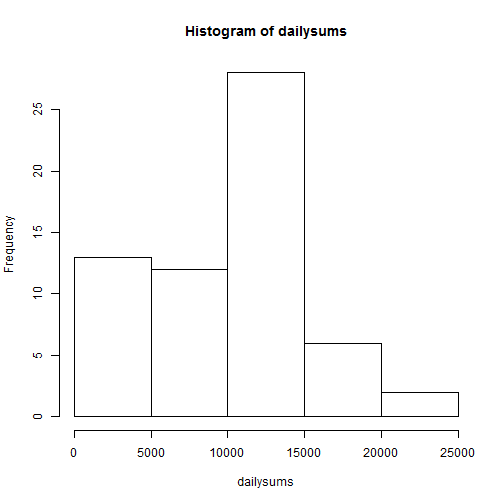
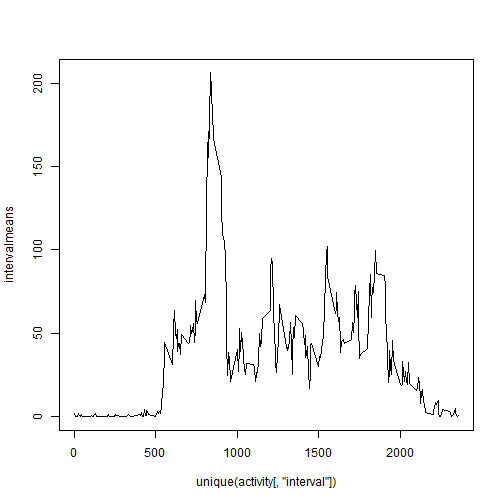
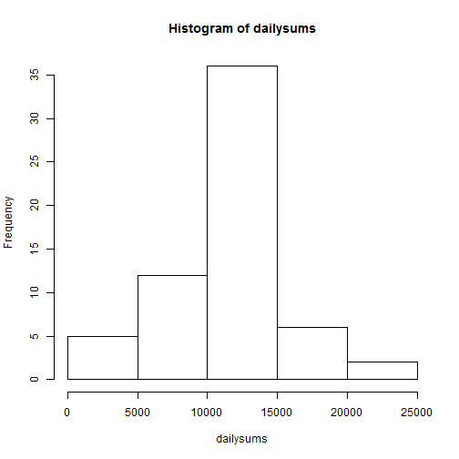
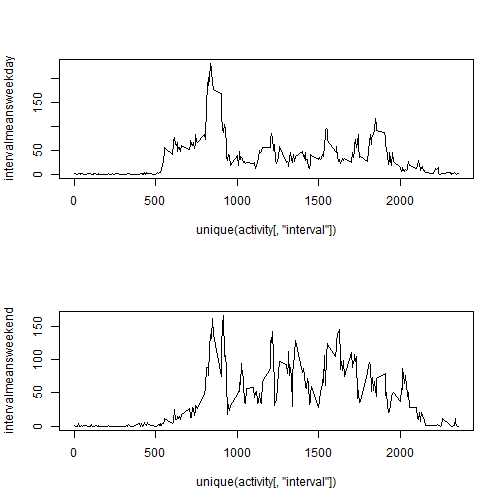

Loading and preprocessing the data


```r
activity <- read.csv("activity.csv")
```

Mean total number of steps per day
1. histogram of total number of steps taken each day


```r
dailysums <- tapply(activity[, "steps"], activity[, "date"], sum, na.rm=TRUE)
hist(dailysums)
```

 

2. The mean and median total number of steps each day


```r
mean(dailysums)
```

```
## [1] 9354.23
```

```r
median(dailysums)
```

```
## [1] 10395
```

Average Daily Activity Pattern
1. Plot the five minute intervals and the average number of steps taken during that interval on average across all days


```r
intervalmeans <- tapply(activity[, "steps"], activity[, "interval"], mean, na.rm=TRUE)
plot(unique(activity[, "interval"]), intervalmeans, type = "l")
```

 

2. The 5 minute interval with the maximum number of steps, on average has 206.1698 steps. This corresponds to interval number 835. (The which.max function returnsanother value, 104. I don't know what this is.)


```r
max(intervalmeans)
```

```
## [1] 206.1698
```

```r
which.max(intervalmeans)
```

```
## 835 
## 104
```

Imputing Missing Values
1. The total number of missing values (5-minute periods without number of steps recorded) is equal to 17568 intervals. 

```r
length (activity[, "steps"]== "NA")
```

```
## [1] 17568
```

2. Replace the NA values with the mean for the five minute interval

```r
steps <- activity[, "steps"]
steps[is.na(steps)] <- intervalmeans
```

3. Create a new dataset that is equal to the original dataset but with the missing data filled in.

```r
activity$steps <- steps
```

4. Histogram of the total number of steps taken each day, with imputed data included. The mean increases from 9354.23 with the original data to 10,766.19 with the imputed data. The median increases from 10,395 with the original data to 10,766.19 with the imputed data. I find it suspect that the mean and median are equal with the imputed data, though I am not sure where I have gone wrong. In the original activity dataset a lot of the dailysums were zero, presumably because the only nonzero values for those days were NAs(which were removed). In the new dataset with the imputed data we would expect these days to have identical step totals because each daily sum is calculated with the average total for each interval. And indeed this value, 10,766.19 appears for the same days where zero formerly appeared. It makes sense that this value would be the median in the new dataset, I'm just not sure why I am getting that value for the new mean. 


```r
dailysums <- tapply(activity[, "steps"], activity[, "date"], sum)
hist(dailysums)
```

 

```r
mean(dailysums)
```

```
## [1] 10766.19
```

```r
median(dailysums)
```

```
## [1] 10766.19
```

Differences between weekends and weekdays
1. Create new factor variable with the levels "weekday" and "weekend". 


```r
dates <- as.Date(activity[, "date"])
activity$weekday <- weekdays(dates, abbreviate = FALSE)

activity$weekpart <- apply(activity, 1, function(row) 
    
    if(row[4] == "Saturday"){
    "weekend"
    }  else if(row[4] == "Sunday")  {
    "weekend"
    } else {
    "weekday"
    }
)      
```

2. plot the interval means according to weekend versus weekday


```r
par(mfrow = c(2, 1))

intervalmeansweekday <- tapply(activity[activity$weekpart =="weekday", "steps"], activity[activity$weekpart =="weekday", "interval"], mean, na.rm=TRUE)
plot(unique(activity[, "interval"]), intervalmeansweekday, type = "l")


intervalmeansweekend <- tapply(activity[activity$weekpart =="weekend", "steps"], activity[activity$weekpart =="weekend", "interval"], mean, na.rm=TRUE)
plot(unique(activity[, "interval"]), intervalmeansweekend, type = "l")
```

 
